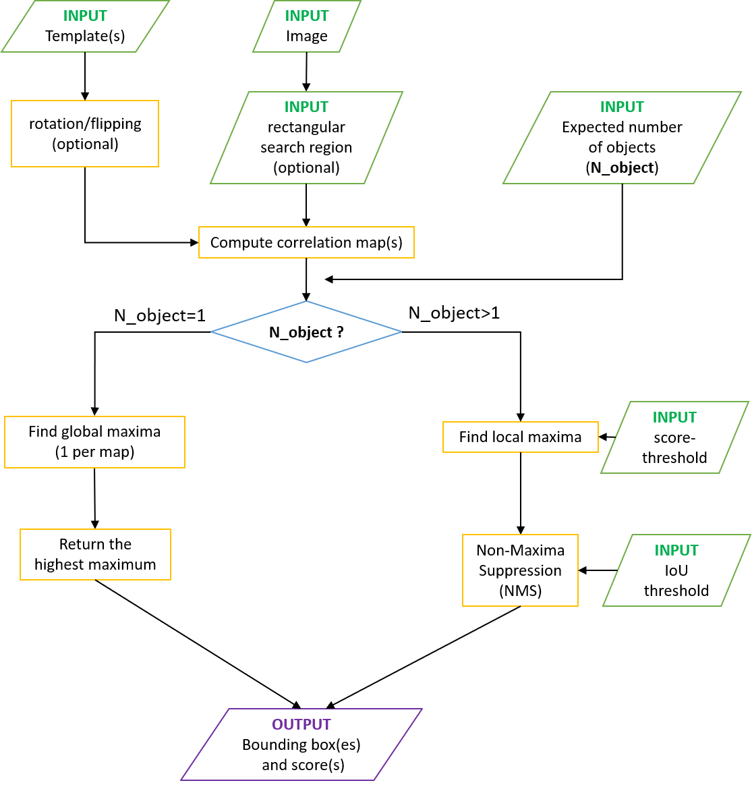

Below is a flowchart describing the Multi-Template-Matching implementation.  
The chart illustrates the sequential execution of the tool, in the case of correlation-based score.  
For difference-based score, the pipeline is identical except that a difference map is computed, minima are detected instead of maxima and the lowest minima are returned. (IoU: Intersection over Union)

